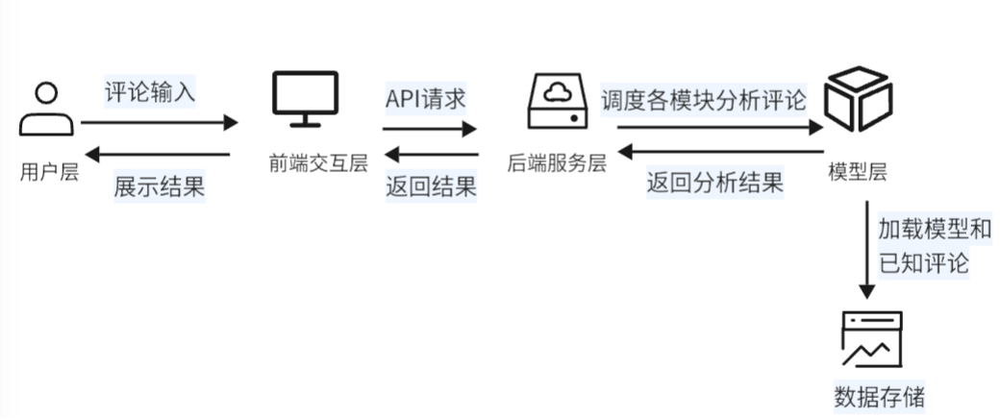
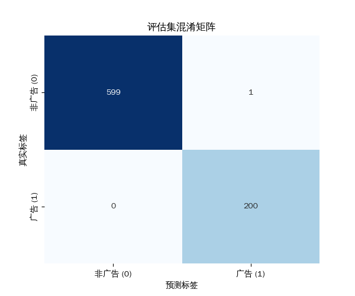

# 多维智能景区评价系统 (Multidimensional-Intelligent-Scenic-Area-Review-System)

[](https://opensource.org/licenses/MIT)
[](https://www.python.org/)
[](https://flask.palletsprojects.com/)
[](https://huggingface.co/transformers)

---

✨ **项目简介**

​       本项目是一套基于深度学习与多维度特征融合的智能评论审核系统，专为解决在线旅游平台（OTA）景区评论区面临的内容质量与信息可信度挑战而设计 。系统通过集成三大核心AI模块，能够精准识别并处理**广告评论**、**复制修改型垃圾评论（洗稿）**，并对正常评论进行**情感倾向分析** [][cite_start]。该系统的目标是净化评论环境，提升信息真实性，最终优化平台内容管理效率和用户决策体验 。

---

📸 **系统最终界面**

### 


### 🎯 **核心问题与解决方案**

在线旅游平台的评论区充斥着大量旨在规避审核的广告、内容空泛的“洗稿”评论，严重干扰了游客的信息筛选与决策过程 。本系统通过一个多维度、分步骤的智能分析流程来应对此问题：



#### 1. **广告评论分类模块**
* **功能**: 作为审核的第一道防线，精准识别评论中的商业广告。
* **技术**: 基于`Transformers`架构，使用在大量中文语料上预训练的 **`chinese-roberta-wwm-ext`** 模型进行微调。为解决广告样本稀疏问题，我们利用 **`gpt-4o-2024-05-13`** 大模型API和提示词工程，生成了多样化、高质量的模拟广告数据，极大地增强了模型的泛化能力。

#### 2. **复制修改垃圾评论检测模块**
* **功能**: 识别那些在语义上与已知垃圾评论高度相似，但通过修改措辞来规避检测的“洗稿”评论。
* **技术**: 采用**双重验证机制**：
    * **语义相似度**: 使用 **`Sentence-BERT (paraphrase-multilingual-MiniLM-L12-v2)`** 模型将评论映射到向量空间，并计算余弦相似度。
    * **编辑距离相似度**: 引入**莱文斯坦编辑距离 (Levenshtein Distance)**，从字符级别衡量文本的相似性 。
    * 只有当一条评论同时满足高语义相似度（如 >0.9）和高编辑距离相似度（如 >0.7）时，才被判定为“洗稿”。

#### 3. **情感分析模块**
* **功能**: 对非垃圾评论进行情感倾向分析（积极/消极/中性），为平台提供用户洞察。
* **技术**: 集成了专门针对中文优化的 **`IDEA-CCNL/Erlangshen-Roberta-330M-Sentiment`** 预训练模型，确保了情感识别的准确性 。

---

### 📊 **项目成果与性能**

#### **广告分类模型性能**
模型在测试集上表现出色，**召回率达到了100%**，确保了所有广告评论都能被成功拦截，同时误判率极低 。
* **真阴性 (TN)**: 599 (非广告被正确识别)
* **假阳性 (FP)**: 1 (非广告被误判为广告) 
* **假阴性 (FN)**: 0 (没有广告被漏掉) 
* **真阳性 (TP)**: 200 (广告被正确识别) 



#### **情感分析模型性能**
模型在情感分类任务上总体表现良好，宏平均F1分数达到**0.81**，尤其在积极（0.89 F1）和消极（0.83 F1）情感上识别效果优异。

| 情感类别   | 精确率 | 召回率 | F1分数 |
| :--------- | :----- | :----- | :----- |
| **积极**   | 0.88   | 0.90   | 0.89   |
| **消极**   | 0.85   | 0.82   | 0.83   |
| **中性**   | 0.75   | 0.70   | 0.72   |
| **宏平均** | 0.83   | 0.81   | 0.8    |
|            |        |        |        |

---

### 🛠️ **技术栈 (Technology Stack)**

* **后端**: Python, Flask [cite: 95][cite_start], Gunicorn
* **深度学习**: PyTorch,Transformers, Sentence-Transformers 
* **核心模型**:
    * `hfl/chinese-roberta-wwm-ext` 
    * `paraphrase-multilingual-MiniLM-L12-v2` 
    * `IDEA-CCNL/Erlangshen-Roberta-330M-Sentiment` 
* **数据增强**: OpenAI GPT-4o API (`gpt-4o-2024-05-13`) 
* **前端**: HTML, JavaScript
* **版本控制**: Git, Git LFS

---

### ⚙️ **安装与运行 (Installation & Usage)**

1.  **克隆仓库**
    ```bash
    git clone [https://github.com/LeeXxxddd/Nlp-Multidimensional-Intelligent-Scenic-Area-Review-System.git]
    cd Nlp-Multidimensional-Intelligent-Scenic-Area-Review-System
    ```

2.  **安装依赖**
    
    ```bash
    pip install -r requirements.txt
    ```
    
3.  **下载预训练模型**
    
    ```bash
    python download_model.py
    ```

4.  **启动后端服务**
    
    ```bash
    gunicorn -w 4 -b 127.0.0.1:5000 app:app
    ```
    
5.  在浏览器中打开 `index.html` 即可与前端界面交互。

---

### 📈 **未来规划 (Future Work)**

根据项目总结，未来可以从以下几个方向进行改进 [cite: 507, 508]：
* **算法优化**: 探索无监督异常检测方法以应对更复杂的“洗稿”变体。
* **功能拓展**: 引入知识图谱辅助识别隐性广告，并增加对图片、视频等多媒体内容的审核能力 。
* **性能提升**: 通过模型推理优化、引入缓存机制或异步框架，提升高并发场景下的实时性 。
* **模型迭代**: 集成主动学习或弱监督学习机制，实现模型的持续自适应，减少对人工标注的依赖 。
